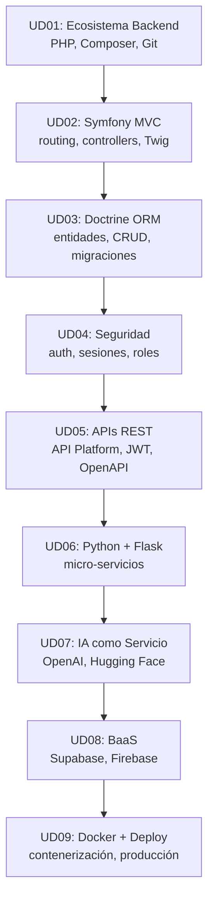

# 🚀 Apuntes DWES: Desarrollo Web en Entorno Servidor

Material docente de **Desarrollo Web en Entorno Servidor** creado por **Nacho Cabrero** para su alumnado en el IES Hermenegildo Lanz (Granada).

Este repositorio es una ruta completa de aprendizaje para dominar el **backend moderno**: desde PHP y Symfony hasta Python con IA, APIs REST, contenerización con Docker y despliegue profesional.

> Revisión documental actualizada a **septiembre de 2026**. Stack actual: PHP 8.3, Symfony 7, Python 3.12, Node.js 22 LTS, Docker, Supabase.

<p align="center">
  <a href="https://www.php.net/"></a>
  <a href="https://symfony.com/"></a>
  <a href="https://www.python.org/"></a>
  <a href="https://flask.palletsprojects.com/"></a>
  <a href="https://www.doctrine-project.org/"></a>
  <a href="https://www.docker.com/"></a>
  <a href="https://supabase.com/"></a>
  <a href="https://jwt.io/"></a>
</p>

<p align="center">
  <a href="LICENSE"></a>
  
  
  
</p>

---

## 🎯 Objetivo General

Formar desarrolladores capaces de crear **aplicaciones y servicios web robustos y modernos**, utilizando múltiples lenguajes y arquitecturas (PHP, Python), integrando servicios de Inteligencia Artificial y aplicando las mejores prácticas del sector.

Al finalizar la ruta, el alumno debería poder:

- Dominar PHP moderno (8.x) con POO, Composer y buenas prácticas.
- Desarrollar aplicaciones web completas con Symfony (MVC, Twig, Formularios, Seguridad).
- Gestionar bases de datos con Doctrine ORM y crear CRUDs profesionales.
- Crear micro-servicios en Python con Flask e integrar APIs de IA.
- Construir APIs REST profesionales con Symfony/API Platform y documentarlas con OpenAPI.
- Utilizar Backend-as-a-Service (Supabase/Firebase) para aplicaciones modernas.
- Contenerizar aplicaciones con Docker y orquestar con Docker Compose.
- Desplegar aplicaciones en servidores de producción.

---

## 📚 Stack de Aprendizaje

| Área | Tecnología | Qué aporta al alumno |
| --- | --- | --- |
| Lenguaje principal | PHP 8.3 | Base del desarrollo backend actual. |
| Framework principal | Symfony 7 | Framework profesional con componentes reutilizables. |
| Motor plantillas | Twig | Plantillas seguras y potentes para la vista. |
| ORM | Doctrine | Mapeo objeto-relacional para bases de datos. |
| Segundo lenguaje | Python 3.12 | Versatilidad y acceso a IA. |
| Micro-servicios | Flask | Framework ligero para APIs y servicios. |
| APIs REST | API Platform | Creación rápida de APIs profesionales. |
| Autenticación | JWT (JSON Web Tokens) | Autenticación sin estado para APIs. |
| Base de datos | MySQL / PostgreSQL | Almacenamiento relacional. |
| BaaS | Supabase | Backend completo: auth, DB, storage en tiempo real. |
| Contenerización | Docker | Aislamiento y portabilidad de aplicaciones. |
| Orquestación | Docker Compose | Multi-contenedor: PHP + Python + BBDD. |
| Control versiones | Git | Colaboración profesional. |
| Documentación | Swagger/OpenAPI | Documentación interactiva de APIs. |

---

## 🗺️ Roadmap del Alumno



**Regla práctica:** cada unidad tiene un proyecto práctico que se va ampliando. Al final, tendrás una arquitectura completa: Symfony + Python/IA + Docker + Deploy.

> [!TIP]
> Antes de empezar con frameworks o IA, el alumno debe dominar los fundamentos de PHP y entender cómo funciona el modelo cliente-servidor.

---

## 📖 Unidades Didácticas

### UD01: El Ecosistema del Desarrollo Backend Moderno 🌍

**Objetivo:** Comprender la arquitectura cliente-servidor actual y configurar un entorno de desarrollo profesional desde el primer día.

**Contenidos:**

- Arquitectura Cliente-Servidor y el ciclo Petición/Respuesta (HTTP)
- Introducción a las APIs como lenguaje de la web moderna
- Control de Versiones con Git: `init`, `add`, `commit`, `push`
- PHP en el siglo XXI: Sintaxis moderna, tipado y Composer
- Configuración del entorno de desarrollo local

**Proyecto Práctico:** Inicializar un proyecto con Composer, crear un script "Hola Mundo" en PHP y subir el primer commit a un repositorio Git.

📁 [Ver unidad](UD01_Ecosistema_Backend/)

---

### UD02: Construcción de Aplicaciones con Symfony (I) - El Núcleo del Framework 🚀

**Objetivo:** Entender el patrón MVC en un contexto real y construir las primeras páginas dinámicas de una aplicación.

**Contenidos:**

- El patrón MVC (Modelo-Vista-Controlador) y su importancia
- Estructura de un proyecto Symfony
- Enrutamiento: Mapeo de URLs a la lógica de la aplicación
- Controladores: Dónde reside la lógica de negocio
- Motor de Plantillas Twig: Separar lógica y presentación

**Proyecto Práctico:** Crear la estructura inicial de una aplicación (foro de discusión), con sus páginas principales usando rutas, controladores y plantillas Twig.

📁 [Ver unidad](UD02_Symfony_Nucleo/)

---

### UD03: Persistencia de Datos con Doctrine ORM 💾

**Objetivo:** Modelar la lógica de negocio y persistir la información en una base de datos utilizando herramientas profesionales.

**Contenidos:**

- ORM (Object-Relational Mapping): El puente entre objetos PHP y BBDD
- Doctrine: El ORM por defecto en Symfony
- Entidades: Clases PHP que representan tablas de la base de datos
- Operaciones CRUD: Entity Manager y Repositorios
- Migraciones: Versionado de la estructura de la base de datos

**Proyecto Práctico:** Dar vida al foro. Permitir crear nuevos temas, listarlos desde la BBDD, ver el detalle y borrarlos.

📁 [Ver unidad](UD03_Doctrine_OORM/)

---

### UD04: Seguridad y Sesiones en Aplicaciones Profesionales 🔐

**Objetivo:** Implementar un sistema de autenticación y autorización completo para proteger rutas y gestionar roles de usuario.

**Contenidos:**

- Autenticación (quién eres) vs. Autorización (qué puedes hacer)
- El Componente de Seguridad de Symfony
- Gestión de Sesiones y el problema del estado en HTTP
- Formulario de login y sistema de registro
- Hashing de contraseñas
- Roles y permisos: Restringir acceso a partes de la aplicación

**Proyecto Práctico:** Añadir un sistema de usuarios al foro. Registro y login. Crear un rol "MODERADOR" que pueda borrar temas.

📁 [Ver unidad](UD04_Seguridad_Sesiones/)

---

### UD05: Creación de Servicios: APIs REST con Symfony 📡

**Objetivo:** Diseñar y construir una API REST para que la aplicación pueda ser consumida por otros clientes.

**Contenidos:**

- Principios de la arquitectura REST
- Endpoints que devuelven JSON
- API Platform: Creación rápida de APIs estandarizadas
- Autenticación para APIs: Tokens JWT
- Documentación automática con OpenAPI (Swagger)

**Proyecto Práctico:** Crear una API REST que exponga los temas del foro. Endpoint para listar y obtener por ID. Proteger la creación con token.

📁 [Ver unidad](UD05_APIs_REST/)

---

### UD06: Python y Flask: Creando Microservicios Inteligentes 🐍

**Objetivo:** Aprender los fundamentos de Python y Flask para construir servicios pequeños y especializados.

**Contenidos:**

- Fundamentos de Python: Sintaxis, tipos, listas, diccionarios
- El concepto de Microservicio
- Flask: Micro-framework para APIs y servicios ligeros
- Rutas y manejo de peticiones JSON en Flask

**Proyecto Práctico:** Crear un microservicio en Flask con un único endpoint. El embrión de nuestro servicio de IA.

📁 [Ver unidad](UD06_Python_Flask/)

---

### UD07: Integración de Inteligencia Artificial (IA) en el Backend 🧠

**Objetivo:** Entender cómo consumir servicios de IA de terceros y cómo integrarlos para añadir funcionalidades inteligentes.

**Contenidos:**

- IA como Servicio (AIaaS): APIs de OpenAI, Hugging Face, Google AI
- Llamadas a APIs externas desde Python con `requests`
- Manejo seguro de credenciales y claves API
- Casos de uso: Análisis de sentimiento, generación de texto, clasificación

**Proyecto Práctico:** Evolucionar el microservicio de Flask. Recibir un texto, enviarlo a una API de IA para analizar su sentimiento, y devolver el resultado. Conectar con el foro en Symfony.

📁 [Ver unidad](UD07_Integracion_IA/)

---

### UD08: Arquitecturas Alternativas: Backend-as-a-Service (BaaS) ✨

**Objetivo:** Comprender el paradigma "serverless" y ser capaz de desarrollar aplicaciones sin gestionar un backend propio.

**Contenidos:**

- Ventajas y desventajas de las arquitecturas BaaS
- Introducción a Supabase: Alternativa Open Source a Firebase
- Funcionalidades clave: Auth, base de datos en tiempo real (Postgres), storage
- Interacción con un BaaS desde un cliente en JavaScript

**Proyecto Práctico:** Crear una SPA con JavaScript que utilice Supabase para gestionar una lista de tareas colaborativa en tiempo real.

📁 [Ver unidad](UD08_BaaS_Supabase/)

---

### UD09: El Paso a Producción: Docker y Despliegue 📦🚢

**Objetivo:** Aprender a empaquetar y desplegar aplicaciones de forma profesional y reproducible.

**Contenidos:**

- El problema del despliegue: "En mi máquina funciona"
- Contenerización con Docker: La solución estándar
- Creación de Dockerfile para Symfony y Flask
- Orquestación con Docker Compose: Arquitectura multi-contenedor
- Introducción a CI/CD

**Proyecto Final (Proyecto 5):** Crear un `docker-compose.yml` que levante toda la arquitectura del foro (Symfony), su base de datos y el microservicio de IA (Flask).

📁 [Ver unidad](UD09_Docker_Deploy/)

---

## 📊 Progreso por Competencias

| Competencia | Estado esperado | Evidencia |
| --- | --- | --- |
| PHP Moderno | Escribe PHP 8.x con POO y Composer | UD01 + Proyecto 1 |
| Symfony MVC | Construye apps con routing, controllers, Twig | Proyecto 1 |
| Doctrine ORM | Crea entidades, repositorios y CRUDs | Proyecto 1 ampliado |
| Seguridad | Implementa auth, roles y permisos | Proyecto 1 ampliado |
| APIs REST | Crea APIs con JWT y documentación OpenAPI | Proyecto 3 |
| Python + Flask | Escribe micro-servicios | Proyecto 2 |
| IAaaS | Integra APIs de IA en aplicaciones | Proyecto 2 + integración |
| BaaS | Construye apps con Supabase | Proyecto 4 |
| Docker | Conteneriza y orquesta aplicaciones | Proyecto Final |
| Deploy | Despliega aplicaciones en producción | Proyecto Final |

### Checklist de Madurez

- [ ] Escribo código PHP moderno con POO y Composer sin depender de ejemplos.
- [ ] Entiendo el patrón MVC y lo aplico con Symfony.
- [ ] Creo entidades Doctrine y genero CRUDs automáticamente.
- [ ] Implemento autenticación y autorización con roles.
- [ ] Construyo APIs REST con JWT y las documento con OpenAPI.
- [ ] Escribo micro-servicios en Python con Flask.
- [ ] Integro APIs de IA (OpenAI, Hugging Face) en aplicaciones.
- [ ] Uso Supabase como backend para aplicaciones frontend.
- [ ] Contenerizo aplicaciones con Docker y orquesto con Compose.
- [ ] Despliego una aplicación completa en producción.

---

## 🏗️ Estructura del Repositorio

```text
apuntes-DWES/
├── UD01_Ecosistema_Backend/
├── UD02_Symfony_Nucleo/
├── UD03_Doctrine_OORM/
├── UD04_Seguridad_Sesiones/
├── UD05_APIs_REST/
├── UD06_Python_Flask/
├── UD07_Integracion_IA/
├── UD08_BaaS_Supabase/
├── UD09_Docker_Deploy/
├── Ejercicios/
│   ├── UD01/
│   ├── UD02/
│   ├── UD03/
│   ├── UD04/
│   ├── UD05/
│   ├── UD06/
│   ├── UD07/
│   ├── UD08/
│   └── UD09/
├── Proyectos/
│   ├── Proyecto1_Foro/
│   ├── Proyecto2_Microservicio_IA/
│   ├── Proyecto3_API_REST/
│   ├── Proyecto4_App_Supabase/
│   └── ProyectoFinal_Arquitectura/
├── docs/
├── .github/
│   └── ISSUE_TEMPLATE/
├── CITATION.cff
├── CONTRIBUTING.md
├── LICENSE
└── README.md
```

---

## 📝 Ejercicios y Prácticas

### Ejercicios por Unidad

Cada unidad tiene ejercicios prácticos en la carpeta `Ejercicios/UDXX/`.

### Proyectos Prácticos

Cada bloque tiene un proyecto práctico que se va ampliando:

1. **Proyecto 1**: Foro de discusión o CMS básico con Symfony
2. **Proyecto 2**: Micro-servicio de IA con Python/Flask
3. **Proyecto 3**: API REST profesional con Symfony/API Platform
4. **Proyecto 4**: App colaborativa con frontend JS + Supabase
5. **Proyecto Final**: Arquitectura completa (Symfony + Python/IA + Docker + Deploy)

---

## 🔗 Recursos Adicionales

- [Documentación oficial de PHP](https://www.php.net/manual/es/)
- [Documentación oficial de Symfony](https://symfony.com/doc/current/index.html)
- [Documentación oficial de Doctrine](https://www.doctrine-project.org/documentation.html)
- [Documentación oficial de Python](https://docs.python.org/3/)
- [Documentación oficial de Flask](https://flask.palletsprojects.com/)
- [Documentación oficial de Docker](https://docs.docker.com/)
- [Documentación oficial de Supabase](https://supabase.com/docs)
- [Documentación oficial de API Platform](https://api-platform.com/docs/)

---

## 📄 Licencia y Atribución

Este material se publica bajo **Creative Commons Attribution 4.0 International (CC BY 4.0)**.

Puedes consultar, compartir y adaptar el contenido, pero debes atribuir la autoría de forma clara:

```text
Apuntes DWES: Desarrollo Web en Entorno Servidor
Autor: Nacho Cabrero
Centro: IES Hermenegildo Lanz (Granada)
Repositorio: https://github.com/nachocabrero/apuntes-DWES
Licencia: CC BY 4.0
```

---

## 👨‍🏫 Autor

**Nacho Cabrero**
Profesor de Informática en el IES Hermenegildo Lanz (Granada).

- GitHub: [nachocabrero](https://github.com/nachocabrero)

---

## 📚 Fuentes

- [PHP Manual](https://www.php.net/manual/es/)
- [Symfony Documentation](https://symfony.com/doc/current/index.html)
- [Doctrine ORM Documentation](https://www.doctrine-project.org/documentation.html)
- [Python Documentation](https://docs.python.org/3/)
- [Flask Documentation](https://flask.palletsprojects.com/)
- [Docker Documentation](https://docs.docker.com/)
- [Supabase Documentation](https://supabase.com/docs)
- [API Platform Documentation](https://api-platform.com/docs/)
- [JWT.io](https://jwt.io/)
- [OpenAPI Specification](https://spec.openapis.org/)
- [Creative Commons BY 4.0](https://creativecommons.org/licenses/by/4.0/)
